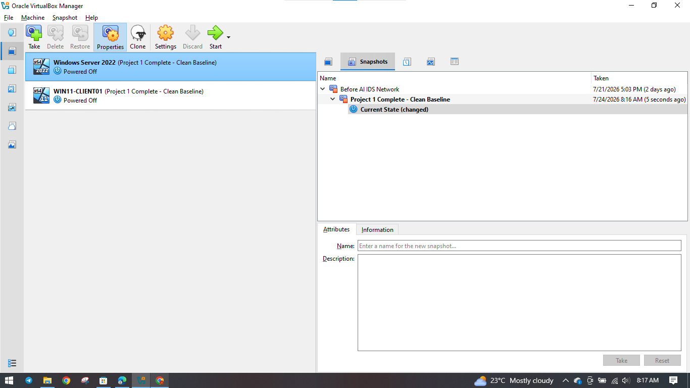
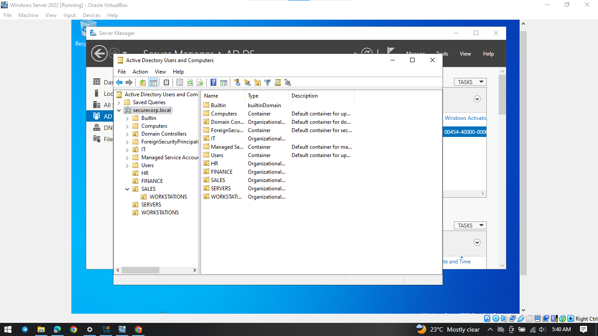
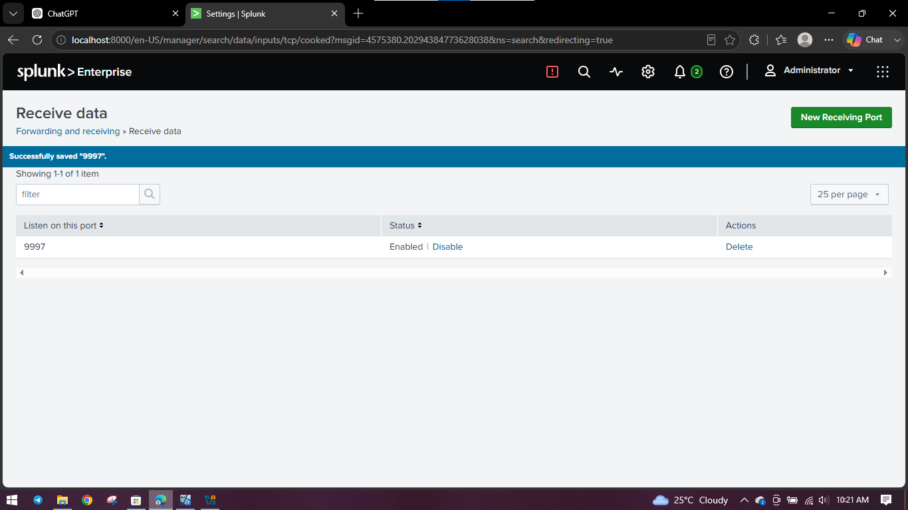
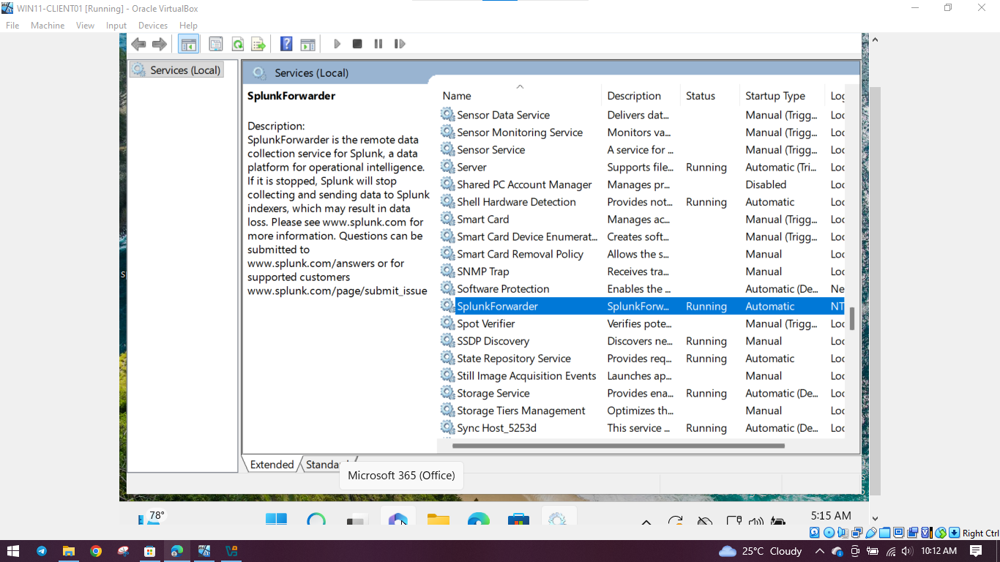
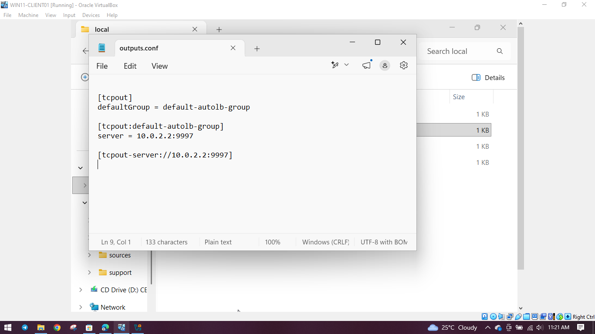
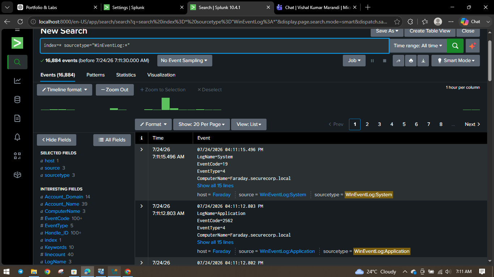
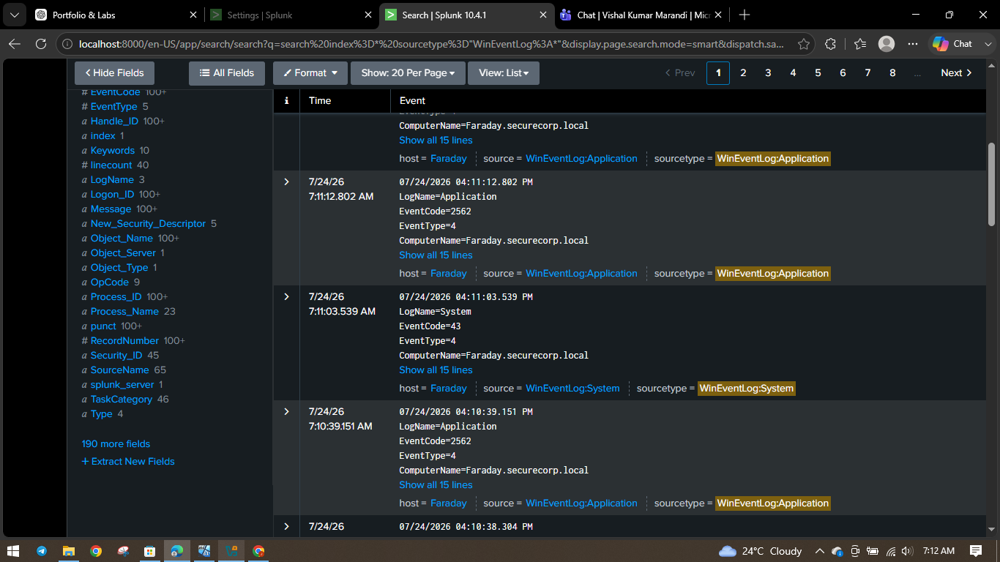

# Enterprise Active Directory and Splunk SIEM Lab

A practical Windows security project showing how I built a small enterprise lab, managed identities with Active Directory, forwarded endpoint logs, and confirmed that the events were available in Splunk for monitoring and investigation.

## Project Status

**Active Directory and centralized log collection: completed**  
**Controlled detection and incident-investigation exercises: next phase**

## Project Summary

This project recreates a small company environment inside VirtualBox. Windows Server 2022 was configured as the domain controller for the fictional `securecorp.local` domain. A Windows 11 endpoint was joined to the environment and configured to send Windows events to Splunk Enterprise through the Splunk Universal Forwarder.

The main purpose was to prove that the complete monitoring path worked:

**Windows endpoint → Splunk Universal Forwarder → TCP port 9997 → Splunk Enterprise → searchable events**

The screenshots below follow the order in which the environment was prepared and tested. Each stage explains the work completed, shows the evidence, and states why the result matters.

---

## Stage 1 — Build and preserve the virtual lab

I created two virtual machines in Oracle VirtualBox: one Windows Server 2022 machine and one Windows 11 client. After the main setup and testing were completed, I saved clean baseline snapshots for both machines.

  

**Result:** The completed lab was preserved at a stable recovery point. The snapshots allow me to return the machines to a known working state before future security tests.

**Why it matters:** This demonstrates basic change-management, recovery-planning, and evidence-preservation practices. These are important in GRC work because security testing should be repeatable and controlled.

---

## Stage 2 — Create the Active Directory identity structure

I configured Active Directory Domain Services and created the fictional `securecorp.local` domain. I also organized the environment with units for IT, HR, Finance, Sales, Servers, Users, and Workstations.

  

**Result:** The lab had a central system for managing users, computers, departments, and domain resources.

**Why it matters:** Active Directory supports identity governance, access control, account management, least privilege, and audit review. For a SOC analyst, an organized domain also makes it easier to connect security events to the correct user, computer, or department.

---

## Stage 3 — Prepare Splunk to receive endpoint data

Before the Windows endpoint could send its events, I configured Splunk Enterprise to listen for Universal Forwarder traffic on TCP port `9997`.

  

**Result:** Splunk was ready to receive forwarded data from the endpoint.

**Why it matters:** A centralized logging control cannot work unless the SIEM is prepared to accept the data. This screenshot provides direct configuration evidence that the receiving control was enabled.

---

## Stage 4 — Confirm the Universal Forwarder is running

I checked the Windows Services console to confirm that the `SplunkForwarder` service was active. The service was shown as **Running**, and its startup type was set to **Automatic**.

  

**Result:** The endpoint collection service was operating and configured to start again after a restart.

**Why it matters:** If the forwarder stops, the SOC may lose visibility into endpoint activity. Service-state evidence helps show that the monitoring control was operating when the lab was tested.

---

## Stage 5 — Direct the endpoint logs to Splunk

I reviewed the Universal Forwarder `outputs.conf` file. It directed the Windows endpoint to send its events to the Splunk receiver at the private lab address `10.0.2.2:9997`.

  

**Result:** The endpoint destination matched the receiving port configured in Splunk.

**Why it matters:** This connects the endpoint side of the logging control to the SIEM side. Documenting the destination improves configuration traceability and makes technical or audit reviews easier.

> `10.0.2.2` is a private VirtualBox lab address. It is not a public or production system.

---

## Stage 6 — Confirm that Windows events reached Splunk

I used the Splunk search `index=* sourcetype="WinEventLog:*"` to check whether the Windows events had travelled through the complete collection path. The search returned **16,884 events** from `Faraday.securecorp.local`.

  

**Result:** Windows System and Application events reached Splunk and became searchable.

**Why it matters:** This is end-to-end validation. It proves that the control produced the expected result instead of only showing that individual settings existed. Searchable events provide the visibility needed for alert review, incident investigation, threat hunting, and future detection development.

---

## Stage 7 — Review the indexed event details

After confirming the total event count, I examined individual records. The evidence shows useful fields such as the event time, log name, event code, computer name, source, and sourcetype.

  

**Result:** Splunk stored detailed event information that an analyst could open, compare, and use during an investigation.

**Why it matters:** Detailed logs support timeline building, endpoint investigation, traceability, and audit evidence. They allow an analyst to move from a general alert or event count to the exact records needed for review.

---

## Security and Governance Value

### Governance, Risk and Compliance

This project demonstrates identity organization, access-governance foundations, configuration evidence, centralized audit logs, control validation, recovery points, and clear technical documentation. These are useful skills for supporting security assessments, audit preparation, control testing, and risk reviews.

### Security Operations

The completed log pipeline provides the visibility required for event review, alert triage, incident investigation, threat hunting, and detection engineering.

### AI Governance and AI Security

This lab is not an AI assessment. However, the same governance principles also apply to AI-enabled services: controlled identities, reliable logs, traceability, access monitoring, incident evidence, human review, and proof that technical controls are working as intended.

## Skills Demonstrated

- Active Directory deployment and domain administration
- Identity and organizational-unit management
- Windows endpoint onboarding
- Splunk Enterprise receiving configuration
- Splunk Universal Forwarder configuration
- Centralized Windows event collection
- Basic SPL searching and validation
- Log-pipeline troubleshooting
- Evidence collection and technical documentation
- Change-management and recovery awareness
- GRC-focused control validation

## Evidence Safety

This is a fictional and isolated lab environment. No real company data, production credentials, passwords, authentication tokens, or public infrastructure are included.

## Next Phase

The next phase will generate controlled authentication activity, identify the related Windows events in Splunk, develop a detection search, investigate the activity, and document the findings in a SOC-style report.

## Author

**Raymond Amoako**  
Cybersecurity focus: Governance, Risk and Compliance; SOC operations; cloud security; vulnerability management; and AI governance  
[GitHub Profile](https://github.com/RAY883)
